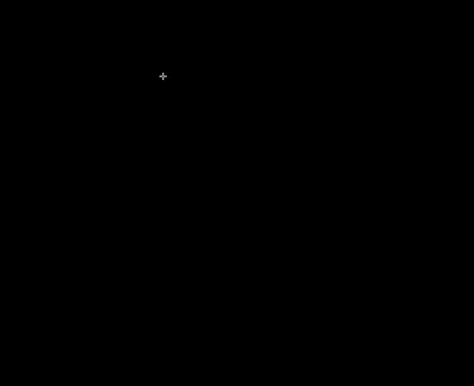
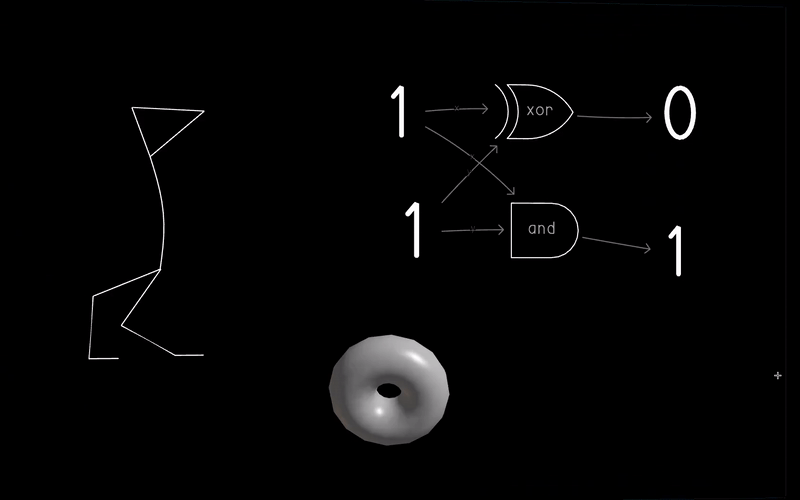
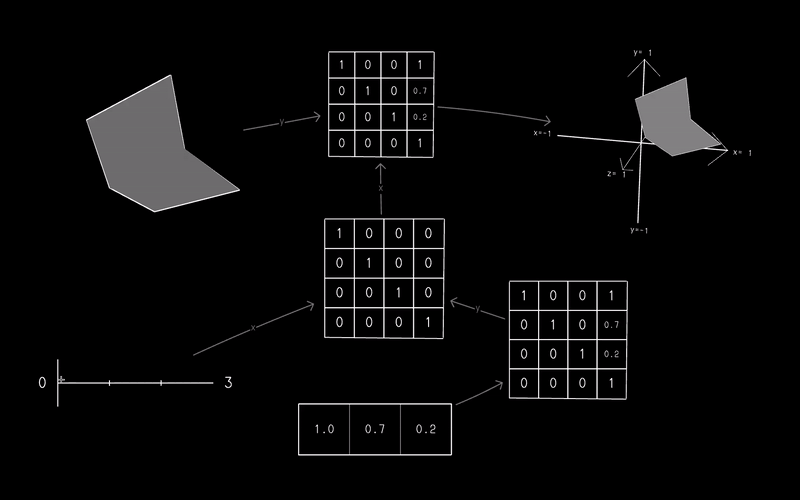
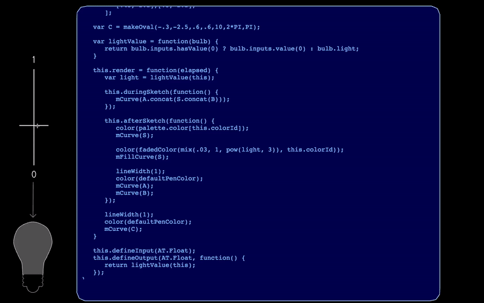

# Chalktalk

**Chalktalk** is a digital presentation and communication language 
in development at [New York University's Future Reality Lab](https://frl.nyu.edu/).
Using a blackboard-like interface, it allows a presenter to create and interact
with animated digital sketches in order to demonstrate ideas and concepts in the context
of a live presentation or conversation.

Sketches can display animations and graphics in 2D and 3D…

…link together to demonstrate complex logical connections and behaviors…

…and even be coded live from within Chalktalk itself.

A growing library of sketches--from creatures to math and physics objects--is available,
and Chalktalk continues to evolve.

## Installation and Usage

Installation instructions can be found [in the wiki](https://github.com/kenperlin/chalktalk/wiki/Installation-and-Running). A brief tutorial on how to use the system [can be found there as well](https://github.com/kenperlin/chalktalk/wiki/Introduction-to-Chalktalk).

## Contribution

See [the contribution guidelines](/CONTRIBUTING.md) to learn how to contribute to Chalktalk.

## Sketch Creation

To create your own sketch, create a new .js file (nameOfMySketch.js) or copy a template (from sketch_templates) into the sketches directory. 

In your file, change the value of `this.label` and begin customizing your new sketch.

Note: a soon-to-be-enabled update will implement a sketch tagging system where each sketch is associated with one or more tags (attributes / descriptions), so new pull requests with sketches to be added should use `this.tag = "tagname"` or `this.tags = ["tagname1", "tagname2"]` within the function body of a sketch file (similar to `this.label` and `this.labels`). Tag names should be general enough to apply to multiple sketches.

[Further information on sketch creation can be found in the wiki](https://github.com/kenperlin/chalktalk/wiki/Creating-a-Sketch).

## License 
MIT
